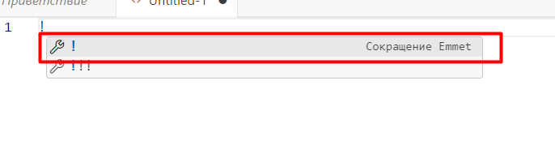
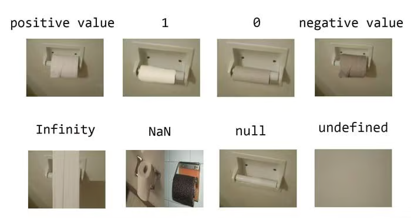
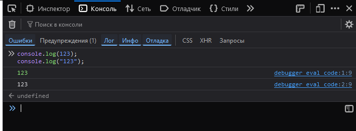
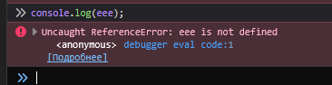

# Содержание

1. Знакомство с HTML
   1. Основная структура страницы HTML
2. Введение в язык JavaScript для новичков
   1. Запуск JavaScript
   2. **Задача 1**
   3. **Задача 2**
   4. Запустите через браузер и проверьте
   5. Комментарии в JavaScript
   6. Переменные в JavaScript
   7. Объявление переменных
   8. Объявление нескольких переменных в JavaScript
   9. Инструменты разработчика
   10. Сложение строк в JavaScript или конкотонация
   11. Длина строки в JavaScript
   12. Шаблонные строки в JavaScript
   13. Специальные значения в JavaScript
   14. Ошибки в консоли JavaScript
   15. Типы ошибок
   16. Автоматическое преобразование типов данных
   17. Не явное (сокращенное) преобразование к числу в JavaScript
   18. Выделение чисел в JavaScript
   19. Преобразование к строке в JavaScript
   20. Получение символов строки на JavaScript
   21. Неизменяемость строк в JavaScript
   22. Сокращенные операции в JavaScript
   23. Операции инкремента и декремента в JavaScript
   24. Префиксный и постфиксный тип в JavaScript

---

# Знакомство с HTML

Язык HTML — это основа web сайтов, с его помощью создается каркас страницы, которую вы видите в браузере. Если сравнивать страницу сайта и обычную бумажную книгу, то на сайте, как и в книге, есть абзацы и заголовки.

**HTML теги** — это специальные команды для браузера. Они говорят ему, что, к примеру, следует считать заголовком страницы, а что абзацем.

Теги строятся по такому принципу: **уголок <, потом имя тега, а потом уголок >**. Имя тега может состоять из английских букв и цифр. Примеры тегов:

```html
<h1>Заголовок 1 уровня</h1>
<p>простой текст</p>
<b>жирный текст</b>
```

Теги обычно пишутся парами - открывающий тег и соответствующий ему закрывающий. **Разница между открывающим и закрывающим тегами в том, что в закрывающем теге после уголка < стоит слеш /.**

К примеру, < p > - так я открыл тег, а так - < /> - я его закрыл(без внутренних пробелов!).

Все, что попадает между открывающим и закрывающим тегами, подпадает под воздействие нашего тега.

Бывают теги, которые не нужно закрывать, например, < br> или < img>.

В тегах также могут размещаться атрибуты - специальные команды, которые расширяют действие тега. Атрибуты размещаются внутри открывающего тега в таком формате:

```html
<тег атрибут1="значение" атрибут2="значение">
```

Кавычки могут быть любыми - одинарными или двойными, допустимо их вообще не ставить, если значение атрибута состоит из одного слова (но это не желательно).

HTML тегам можно менять стили: цвета, размеры, шрифты, фон, а также позицию на экране. Для этого используется язык CSS, который расширяет возможности языка HTML.

Получается, что с помощью HTML тегов создается структура сайта, а с помощью CSS стилей эта структура украшается и размещается по нужным местам.

Совместное использование HTML и CSS называется версткой страниц.

---

## Основная структура страницы HTML

Страница сайта - это обычный текстовый файл с расширением .html. Внутри этого файла и хранится текст HTML страницы вместе с тегами. Этот файл обязательно должен иметь следующие теги: тег < html>, который должен содержать в себе текст всего сайта (все, что написано вне этого тега, браузером будет проигнорировано), а внутри него должны быть еще два тега: тег < head> для служебного содержимого страницы и тег < body> - для основного текста, который и виден на экране браузера.

В служебное содержимое, которое располагается внутри тега < head>, входит много различных вещей, но пока нам нужны только две из них. Это тег < title>, задающий название страницы, которое будет видно во вкладке браузера, и тег < meta>, который задает кодировку страницы (она ставится в атрибуте charset и обычно имеет значение utf-8).

Кроме того, перед тегом < html> обычно пишется конструкция doctype, которая указывает версию языка HTML, на которой сделан сайт. Актуальная сейчас версия языка имеет номер пять и доктайп для нее должен выглядеть так - < !DOCTYPE html>.

_Итак, давайте посмотрим на основную структуру страницы: _

```html
<!DOCTYPE html>
<html lang="en">
	<head>
		<meta charset="UTF-8" />
		<meta name="viewport" content="width=device-width, initial-scale=1.0" />
		<title>Document</title>
	</head>
	<body>
		This is the main content of the page.
	</body>
</html>
```

После того как вы вставили код, сохраняем файл `index.html`. После двойным щелчком открываем в браузере.

_Очень удобно пользоваться сниппетами. Сниппеты — это заранее определённые фрагменты кода, которые можно вставить в редактор кода, набрав несколько букв.
Для того, чтобы развернуть код выше, можно поставить знак восклицания. Как на картинке. Но только для visual Code._



---

# Введение в язык JavaScript для новичков

### Запуск JavaScript

Во первых JavaScript код может писаться прямо на HTML странице внутри тега script. Этот тег можно размещать в любом месте страницы. Смотрите пример:

```html
<!DOCTYPE html>
<html>
	<head>
		<meta charset="utf-8" />
		<title>Это заголовок тайтл</title>
		<script>
			здесь пишем JavaScript код
		</script>
	</head>
	<body>
		Это основное содержимое страницы.
	</body>
</html>
```

### 1.Например добавить вот эту запись и посмотреть, что она даст.

```js
alert("Привет, мир!");
```

Давайте разберем код написанной нами выше программы. Первым понятием, которое вам нужно узнать, являются **функции**. Функции позволяют выполнять некоторые действия. В нашем примере есть функция `alert()`, которая выводит текст на экран в виде диалогового окошка.

Функция состоит из имени (в нашем случае это `alert`) и круглых скобок, написанных после этого имени. В этих круглых скобках следует писать параметры функции. В нашем случае параметром является текст, который выводится на экран.

В нашем случае функция имеет один параметр, однако бывают функции, в которые нужно передавать несколько параметров. В этом случае эти параметры пишутся через запятую.

---

Во вторых, JavaScript код можно писать в отдельном файле, который затем будет подключен к HTML файлу. Мы так и будем делать.

### 2. Для начала создадим файл с нашим скриптом. У этого файла должно быть расширение .js. Для примера давайте назовем его script.js. (предыдущий код комментируем горячей клавишей ctrl + /)

Разместим в нем какой-нибудь код:

```html
<!DOCTYPE html>
<html>
	<head>
		<meta charset="utf-8" />
		<title></title>
		<!-- <script>
			здесь пишем JavaScript код
		</script> -->
		<script src="script.js"></script>
		<!-- комментарий -->
	</head>
	<body></body>
</html>
```

### Запустите через браузер и проверьте.(не нужно повторять)

Таких файлов можно создавать не ограниченное колличество. Например: .

```html
<script src="script1.js"></script>
<script src="script2.js"></script>
```

    Учтите, что в теге script можно либо писать код, либо подключить файл. Попытка сделать это одновременно не будет работать. Поэтому следующий код не рабочий: (не нужно повторять)

```html
<!DOCTYPE html>
<html>
	<head>
		<meta charset="utf-8" />
		<title></title>
		<script src="script.js">
			alert('text');
		</script>
	</head>
	<body></body>
</html>
```

---

### Комментарии в JavaScript (не нужно повторять)

Подобно языкам HTML и CSS в языке JavaScript можно оставлять комментарии. Они бывают однострочными и многострочными.

Вот пример однострочного комментария:

```js
alert("Привет, мир!"); // комментарий
```

Вот пример многострочного комментария:

```js
/* 	комментарий */
alert("Привет, мир!");
```

---

### Переменные в JavaScript (не нужно повторять)

Основным понятием любого языка программирования является переменная. Переменная представляет собой контейнер, в котором мы можем хранить какие-либо данные, например, строки или числа.

Каждая переменная должна иметь имя, которое может состоять из латинских букв, чисел, символов `$` и знаков подчеркивания. При этом первый символ имени переменной не должен быть цифрой. Примеры названий переменных: `str`, `my_str`, `myStr`, `a1`, `$`, `$a`, `$$a`.

---

### Объявление переменных (не нужно повторять)

В JavaScript для объявления переменных используются три основных ключевых слова: `var`, `let` и `const`. Каждое из них имеет свои особенности и используется в разных сценариях. Рассмотрим их подробнее.

---

### 1. `var`

**Особенности:**

- **Область видимости:** Переменные, объявленные с помощью `var`, имеют функциональную или глобальную область видимости. Это значит, что если переменная объявлена внутри функции, она доступна во всей функции, а если вне — становится глобальной.
- **Поднятие (hoisting):** Объявления переменных с `var` поднимаются вверх функции или глобальной области видимости. Однако значение переменной не поднимается, поэтому до строки с присваиванием переменная имеет значение `undefined`.
- **Отсутствие блочной области видимости:** В отличие от `let` и `const`, переменные, объявленные с `var`, не ограничиваются блоками (например, внутри `if` или `for`).

**Пример:**

```javascript
console.log(a); // undefined (из-за hoisting)
var a = 5;
console.log(a); // 5

if (true) {
	var b = 10;
}
console.log(b); // 10 — переменная доступна вне блока if
```

---

### 2. `let`

**Особенности:**

- **Область видимости:** Переменные, объявленные с помощью `let`, имеют блочную область видимости. Они доступны только внутри блока `{}`, в котором объявлены.
- **Поднятие (hoisting):** Хотя объявления `let` также поднимаются, они находятся в «временной мёртвой зоне» (temporal dead zone) до строки, где произошло объявление. Обращение к переменной до её объявления вызовет ошибку.
- **Изменяемость:** Переменные, объявленные с `let`, могут изменяться, то есть их можно переназначать.

**Пример:**

```javascript
// console.log(x); // Ошибка: нельзя использовать x до объявления (temporal dead zone)
let x = 5;
console.log(x); // 5

if (true) {
	let y = 10;
	console.log(y); // 10
}
// console.log(y); // Ошибка: y не доступна вне блока if
```

---

## 3. `const`

**Особенности:**

- **Область видимости:** Как и `let`, `const` имеет блочную область видимости.
- **Поднятие (hoisting):** Аналогично `let`, переменные, объявленные с `const`, поднимаются, но недоступны до момента объявления (temporal dead zone).
- **Константность:** При использовании `const` переменной нужно сразу присвоить значение, и дальнейшее переназначение невозможно. Однако, если значение является объектом или массивом, то свойства или элементы этого объекта/массива можно изменять (так как изменяется содержимое, а не сама ссылка).

**Пример:**

```javascript
const PI = 3.14;
console.log(PI); // 3.14

// PI = 3.1415; // Ошибка: переназначение константы невозможно

const arr = [1, 2, 3];
arr.push(4); // Разрешено, так как мы изменяем содержимое массива
console.log(arr); // [1, 2, 3, 4]

// arr = [5, 6, 7]; // Ошибка: переназначение переменной невозможно
```

---

## Когда использовать `var`, `let` и `const`?

- **`var`:** На сегодняшний день рекомендуется избегать использования `var` в новом коде из-за её особенностей с областью видимости и поднятием, которые могут приводить к ошибкам. Однако `var` всё ещё встречается в старом коде.
- **`let`:** Используйте, когда значение переменной предполагается изменяться в дальнейшем. Хорошо подходит для счетчиков циклов, временных переменных и так далее.

- **`const`:** Применяйте, когда переменной не планируется переназначение. Это может быть полезно для определения константных значений, конфигураций и ссылок на неизменяемые объекты/массивы.

---

## Итог

- **`var`:** Функциональная или глобальная область видимости, hoisting без временной мёртвой зоны, отсутствие блочной области видимости.
- **`let`:** Блочная область видимости, временная мёртвая зона, возможность переназначения.
- **`const`:** Блочная область видимости, временная мёртвая зона, отсутствие возможности переназначения (но возможность изменения содержимого объектов и массивов).

Понимание различий между `var`, `let` и `const` помогает писать более безопасный, понятный и предсказуемый код в JavaScript.

---

Для того, чтобы использовать переменную, ее сначала необходимо объявить: написать перед ее именем ключевое слово `let`. Давайте объявим, например, переменную с именем `a`:

`let a;`

После объявления переменной в нее можно записать (говорят присвоить ей) какое-либо значение, например, какое-либо число или строку.

Запись данных в переменную осуществляется с помощью операции присваивания `=`. Давайте, например, запишем в переменную `a` число `3`:

```js
let a = 3;
```

А теперь давайте выведем содержимое этой переменной на экран с помощью функции `alert`:

```js
let a = 3; // объявляем    переменную    и задаем ей    значение
alert(a); // выведет 3
```

Не обязательно записывать значение в переменную сразу после объявления. Можно сначала объявить переменную, а потом присвоить ей значение:

```js
let a; // объявим переменную
a = 3; // присвоим    ей значение
alert(a); // выведем    значение переменной    на экран
```

Как вы видите, `let` перед именем переменной пишется только один раз - при объявлении этой переменной. Затем, чтобы использовать переменную, нужно просто писать имя этой переменной.

---

### Объявление нескольких переменных в JavaScript (**_Нужно повторять_**)

Давайте объявим несколько переменных:

```js
let a = 1;
let b = 2;
let c = 3;
```

Приведенный выше код можно упростить, написав let один раз и после него перечислив нужные переменные с их значениями, вот так:

```js
let a = 1,
	b = 2,
	c = 3;
```

Можно вначале объявить все переменные, а потом присваивать им значения:

```js
let a, b, c; // объявляем все 3 переменные

// Присваиваем переменным значения:
a = 1;
b = 2;
c = 3;
```

_У переменных типа `let` значения можно переопределять._

---

В js как и в других языках есть математические операции

```js
//  Сложение:
let a = 1 + 2;
alert(a); // выведет 3

// Вычитание:
let b = 3 - 2;
alert(b); // выведет 1

// Умножение:
let c = 3 * 2;
alert(c); // выведет 6

// Деление:
let d = 4 / 2;
alert(d); // выведет 2

// Остаток от деления в JavaScript
alert(10 % 3); // выведет 1
alert(10 % 2); // выведет 0

// Возведение в степень в JavaScript
let a = 10;
alert(a ** 3); // выведет 1000
```

Математические операции можно производить не только над числами, но и над переменными.

**Но только типа число! Со строками такое не получится.** Всё как в математике.

Математические операции JavaScript имеют такой же приоритет, как в обычной математике. То есть в начале выполняется умножение и деление, а потом уже сложение и вычитание.

Числа могут быть отрицательными. Для этого перед числом необходимо поставить знак минус.

Операция возведения в степень имеет приоритет перед умножением и делением.

---

## **Весь предыдущий код можно закоментировать. Не удалять, для проверки!**

---

### Инструменты разработчика

Инструменты разработчика — это набор утилит, встроенных в современные браузеры и среды разработки, которые помогают анализировать, отлаживать и оптимизировать веб-приложения. Они предоставляют разработчикам возможность «заглянуть под капот» сайта или приложения, увидеть, как устроен его код, как работает сеть, как рендерится страница, и многое другое. Рассмотрим основные категории и функции этих инструментов.

---

## 1. Браузерные инструменты разработчика

### a. Панель **Elements** (Элементы)

- **Что позволяет делать:**  
  Просмотр и редактирование HTML-разметки и CSS-стилей в реальном времени.
- **Преимущества:**
  - Легко отлаживать проблемы с отображением элементов.
  - Пробовать изменения стилей «на лету», не изменяя исходный код.
  - Исследовать структуру DOM дерева страницы.

### b. Панель **Console** (Консоль)

- **Что позволяет делать:**  
  Отображение логов, ошибок и предупреждений, а также возможность выполнения JavaScript-кода напрямую.
- **Преимущества:**
  - Быстро находить ошибки и предупреждения.
  - Тестировать небольшие фрагменты кода.
  - Отслеживать вывод отладочной информации (например, с помощью `console.log`).

### c. Панель **Sources** (Исходники)

- **Что позволяет делать:**  
  Просмотр исходных файлов (HTML, CSS, JavaScript) с возможностью установки точек останова (breakpoints) для пошагового отладки кода.
- **Преимущества:**
  - Детальное изучение работы JavaScript-кода.
  - Возможность временно изменять код для проверки гипотез.
  - Анализ стека вызовов, переменных и контекста исполнения.

### d. Панель **Network** (Сеть)

- **Что позволяет делать:**  
  Мониторинг всех сетевых запросов, выполняемых страницей: загрузка файлов, AJAX-запросы, WebSocket-соединения и т.д.
- **Преимущества:**
  - Анализ скорости загрузки ресурсов.
  - Выявление «узких мест» в производительности.
  - Отслеживание ошибок запросов и проблем с API.

### e. Панель **Performance** (Производительность)

- **Что позволяет делать:**  
  Профилирование и анализ времени выполнения скриптов, рендеринга страницы, анимаций и прочих процессов.
- **Преимущества:**
  - Определение узких мест в производительности.
  - Измерение времени ответа приложения.
  - Поиск проблем, связанных с частыми перерисовками или утечками памяти.

### f. Панель **Application** (Приложение)

- **Что позволяет делать:**  
  Управление хранилищем браузера: Cookies, Local Storage, Session Storage, IndexedDB, а также просмотр данных кеша и сервис-воркеров.
- **Преимущества:**
  - Управление состоянием клиентского хранилища.
  - Отладка работы оффлайн-приложений.
  - Проверка безопасности и жизненного цикла данных.

### g. Дополнительные вкладки

- **Security (Безопасность):**  
  Анализ сертификатов, настроек HTTPS, поиск потенциальных уязвимостей.
- **Lighthouse:**  
  Интегрированный инструмент для аудита производительности, доступности, SEO и лучших практик. Позволяет получить рекомендации по улучшению сайта.
- **Accessibility (Доступность):**  
  Проверка доступности веб-приложения для пользователей с ограниченными возможностями.

**Для открытия инструментов разработчика в браузере обычно используется клавиша `F12`.**

Или чтобы открыть эту панель, вам нужно, находясь на странице сайта кликнуть правой кнопкой мышки в любое место. В появившемся меню нужно выбрать самый нижний пункт (он будет называться Inspect или как-то похоже на это).

В открывшейся панели вы в основном будете пользоваться двумя вкладками: Elements и Console. В первой вкладке вы можете получать информацию по тегам страницы, а во второй - отладочную информацию JavaScript.

\*Весь следующий код необходимо проверять во вкладке **console\***.

---

### **Следующий тип данных строки.**

Как уже упоминалось ранее, данные могут иметь различный тип. Один из типов - числа, мы уже немного изучили. Давайте теперь перейдем к строкам.

Строки создаются с помощью кавычек. Они могут быть одинарными и двоёными, разницы нет:

```js
let str = "abc";
let str2 = /'abc';
//слеш для отображения кавычек в этом файле, в коде писать не надо

console.log(str); // выведет 'abc'
console.log(str2); // выведет 'abc'
```

    console.log - функция для вывода информации в консоль разработчика, теперь мы будем работать с ней.

Здесь и далее, если результат вывода - строка, то я беру его в кавычки, чтобы показать, что это именно строка, вот так: выведет `'abc'`. При выводе строки через alert никаких кавычек появляться не будет (то есть на экран выведется то, что у меня написано внутри кавычек).

---

### Сложение строк в JavaScript или конкотонация

Для сложения строк, так же, как и для сложения чисел, используется оператор **+**:

```js
let str = "abc" + "def"; // складываем две строки
console.log(str); // выведет 'abcdef'

// Строки также могут хранится в переменных:
let str1 = "abc";
let str2 = "def";
console.log(str1 + str2); // выведет 'abcdef'

// Можно также складывать переменные и строки:
let str1 = "abc";
let str2 = "def";
console.log(str1 + "!!!" + str2); // выведет 'abc!!!def'

// Пусть две строки хранятся в переменных, а при их сложении мы хотим вставить между ними пробел. Это делается так:
let str1 = "abc";
let str2 = "def";
console.log(str1 + " " + str2); // выведет 'abc def'

// Пусть переменная только одна:
let str = "abc";
console.log(str + " " + "def"); // выведет 'abc def'

// В этом случае нет смысла выделять пробел, как отдельную строку - вставим его как часть второго слагаемого:
let str = "abc";
console.log(str + " def"); // выведет 'abc def'
```

---

### Длина строки в JavaScript

Количество символов в строке содержится в свойстве length:

```js
let str = "abcde";
console.log(str.length); // выведет 5

// Свойство length можно применять непосредственно к строке:
console.log("abcde".length); // выведет 5

// Пробел также является символом:
console.log("ab de".length); // выведет 5
```

---

### Шаблонные строки в JavaScript

Существует специальный тип кавычек - косые:

```js
let str = `abc`;
console.log(str); // выведет 'abc'

// В косых кавычках можно выполнять вставку переменных. Для этого имя переменной нужно написать в конструкции ${}.

// Давайте посмотрим на примере. Пусть мы хотим выполнить сложение строк и переменной:
let str = "xxx";
let txt = "aaa " + str + " bbb";

// Этот код можно переписать следующим образом:
let str = "xxx";
let txt = `aaa ${str} bbb`;
```

---

### Специальные значения в JavaScript

В JavaScript, как и в других языках программирования, существуют ключевые слова для некоторых специальных значений. Вот они: `undefined`, `null`, `true`, `false`, `NaN`, `Infinity`, `-Infinity`.

1. Значение undefined обозначает неопределенность.

2. Значение null обозначает "ничего". К примеру, мы можем присвоить переменной такое значение в знак того, что там ничего не лежит.

3. Значения true и false обозначают истину и ложь соответственно - это уже тип **данных Логический или булевый**. Они используются для таких вещей, которые предполагают два варианта ответа - да или нет, 0 или 1.

4. Значение NaN (Not-A-Number) обозначает не число. Такое значение получается тогда, когда вы пытаетесь делать математические операции не с числами, а с чем-то другим.

5. Значения Infinity и -Infinity обозначают соответственно бесконечность и минус бесконечность. Такие значения получаются, если какое-то число поделить на ноль - в этом случает JavaScript не выдает ошибку, как в других языках программирования, а возвращает эти значения.



---

В консоли разным цветом выводятся строки и числа. Это часто помогает найти ошибки в программах.

Давайте выведем рядом число и строку, чтобы можно было увидеть разницу в цвете:

**Выполнить в консоли!**

```js
console.log(123);
console.log("123");
```



---

### Ошибки в консоли JavaScript

Когда вы в вашем коде допускаете синтаксическую ошибку, JavaScript выведет информацию об этом в консоль. Такая ошибка будет выведена красным цветом, а справа от нее будет указан номер строки, на которой случилась эта ошибка. Этот номер является ссылкой - на него можно нажать и в консоли откроется ваш код на строке с ошибкой.

Давайте попробуем на практике. Обратимся к несуществуещей переменной. В этом случае JavaScript выдаст ошибку:
**Выполнить в консоли!**

```js
console.log(eee); // Uncaught ReferenceError: eee is not defined
```



---

### Типы ошибок

**Записать и запомнить!**

В процессе разработки на JavaScript вы можете столкнуться с различными типами ошибок. Ниже приведён список распространённых ошибок вместе с объяснением причин их возникновения и примерами, где это уместно.

## 1. **ReferenceError**

**Описание:** Возникает, когда обращаются к переменной, которая не была объявлена или находится вне области видимости.  
**Причины:**

- Ошибка в написании имени переменной (опечатка).
- Попытка обращения к переменной до её объявления, если используется `let` или `const` (из-за временной мёртвой зоны).  
  **Пример:**

```javascript
console.log(myVar); // ReferenceError: myVar is not defined
let myVar = 10;
```

---

## 2. **SyntaxError**

**Описание:** Ошибка синтаксиса возникает, когда код не соответствует грамматическим правилам языка.  
**Причины:**

- Пропущенные или лишние символы (например, фигурные скобки, круглые скобки, точки с запятой).
- Неправильное использование зарезервированных слов.  
  **Пример:**

```javascript
if (true {   // SyntaxError: Unexpected token {
  console.log("Hello");
}
```

---

## 3. **TypeError**

**Описание:** Возникает, когда операция или функция вызывается на значении неподходящего типа.  
**Причины:**

- Попытка вызвать метод у `undefined` или `null`.
- Обращение к свойствам или методам переменных не того типа, к которому они принадлежат.  
  **Пример:**

```javascript
let num = 42;
num(); // TypeError: num is not a function

let obj = null;
console.log(obj.property); // TypeError: Cannot read property 'property' of null
```

---

## 4. **RangeError**

**Описание:** Ошибка, возникающая при указании числового значения, которое находится вне допустимого диапазона.  
**Причины:**

- Неправильное использование методов, которые работают с числами, например, неверная длина массива или рекурсия, выходящая за пределы допустимого уровня вложенности.  
  **Пример:**

```javascript
let arr = new Array(-1); // RangeError: Invalid array length

function recursive() {
	return recursive();
}
recursive(); // Вызовет RangeError: Maximum call stack size exceeded (переполнение стека)
```

---

### Автоматическое преобразование типов данных

Как вы уже знаете, строки в JavaScript следует брать в кавычки. Может быть такое, что всеми символами строки будут являться цифры.

В этом случае переменная `a` также является строкой, но с некоторым нюансом.

Суть нюанса в следующем: если над строкой с цифрами выполнить какую-либо математическую операцию - эта операция будет выполнена так, будто у нас действительно числа, а не строки:

```js
let a = "123";
console.log("2" * "3"); // выведет 6`
```

В данном случае JavaScript видит, что мы пытаемся выполнить недопустимую для строк, но допустимую для чисел операцию.

Он также видит, что фактически наши строки - это числа в кавычках. Поэтому JavaScript автоматически выполняет преобразование этих строк к числам и выполняет соответствующую математическую операцию над ними.

Такое работает, если в наших строках только цифры. Если там будет хотя бы одна буква - JavaScript посчитает операцию некорректной и сделает ее результатом значение `NaN`:

```js
console.log("2" * "3s"); // выведет    NaN
```

Кроме того, автоматическое преобразование происходит, если операция математически корректна, но недопустима для строк.

Например, строки нельзя (а числа можно) умножать, делить, вычитать, поэтому во всех таких операциях будет автоматическое преобразование строк с цифрами в числа.

Однако, строки, как и числа, складываются с помощью оператора `+`. Это значит, что в случае сложения автоматического преобразования не будет:

```js
let a = "1" + "2";
console.log(a); // выведет    '12' - произошло    сложение строк
```

Если одно из слагаемых число, а другое - строка, то всегда побеждает строка:

```js
let a = 1 + "2";
console.log(a); // выведет '12'
```

В таких случаях JavaScript, наоборот, автоматически преобразует числа в строки и выполняет сложение строк.

Есть, однако, нюансы, когда слагаемых больше, чем два: в этом случае преобразование к определенному типу зависит от порядка выполнения операций.

В следующем примере вначале `2` и `3` сложатся как числа, а затем результат прибавится к строке `'1'` уже как строка `'5'`, что в итоге даст строку `'15'`:

```js
let a = "1" + (2 + 3);
console.log(a); // выведет '15'
```

Если же убрать скобки, то все будет складываться слева направо. То есть сначала к строке `'1'` прибавится число `2` и в результате получится строка `'12'`. Затем к этой строке прибавится число `3` и в результате получится строка `'123'`:

```js
let a = "1" + 2 + 3;
console.log(a); // выведет '123'
```

А вот в следующем примере числа `2` и `3` написаны в начале, поэтому сначала они сложатся как числа, дав в результате число `5`, а затем к этому числу прибавится строка `'1'`, дав в итоге строку `'51'`:

```js
let a = 2 + 3 + "1";
console.log(a); // выведет '51'
```

---

Так же есть явное преобразование к типу данных Число.

```js
let a = Number("2"); // в переменную запишется число 2
let b = Number("3"); // в переменную запишется число 3
console.log(a + b); // выведет 5
```

---

### Не явное (сокращенное) преобразование к числу в JavaScript

Часто для сокращения кода вместо Number перед строкой ставят знак +. Таким образом над строкой выполняется операция, допустимая только для чисел и строка переводится в число.

Смотрите пример:

```js
let a = +"2"; // в переменную запишется число 2
let b = +"3"; // в переменную запишется число 3
console.log(a + b); // выведет 5

// Вот еще пример:
let a = "2";
let b = +a; // в b запишется число 2
```

А вот следующий пример, хоть и рабочий, но выглядит не очень красиво. В нем более уместно было бы использование функции Number:

```js
let a = "2";
let b = "3";
console.log(+a + +b); // выведет 5
```

---

### Выделение чисел в JavaScript

Функция Number работает только со строками, состоящими из цифр. Однако, при программировании на JavaScript часто встречаются ситуации, когда вам нужно обращаться со строками, в начале которых стоит число, а затем буквы.

Примером такой строки может быть значение в пикселях: '12px'. Пусть нам необходимо достать стоящее в начале число, отбросив строковую часть. Для такой операции существует функция parseInt. Давайте посмотрим ее работу на примере:

```js
let num = parseInt("12px");
console.log(num); // выведет 12
```

Пиксели, однако, иногда бывают дробными: '12.5px'. В этом случае функция parseInt пасует и выводит только целую часть:

```js
let num = parseInt("12.5px");
console.log(num); // все равно выведет 12
```

В общем-то, возможно такое поведение - это именно то, что вам нужно. Но если нет - используйте функцию parseFloat, которое извлекает число вместе с его дробной частью:

```js
let num = parseFloat("12.5px");
console.log(num); // выведет 12.5
```

Конечно же, отсутствие дробной части не мешает функции parseFloat работать корректно:

```js
let num = parseFloat("12px");
console.log(num); // выведет 12
```

---

### Преобразование к строке в JavaScript

Иногда нужно выполнить обратное преобразование - из числа в строку. Для этого предназначена функция String:

```js
let str = String(123); // теперь в переменной строка '123'

// Еще пример:
let num1 = 1;
let num2 = 2;

console.log(String(num1) + String(num2)); // выведет '12'
```

---

Преобразование логического типа в JavaScript

Сейчас мы с вами рассмотрим, как ведут себя специальные значения true и false при преобразовании их к строкам или числам. Эти знания вам потребуются в следующих уроках.

Итак, попробуем выполнить преобразование к строке, используя функцию String:

```js
alert(String(true)); // выведет 'true'
alert(String(false)); // выведет 'false'
```

Как вы видите, значение `true` преобразуется в строку `'true'`, а значение `false` - в строку `'false'`. То есть при попытке сложения строки и логического значения, это логическое значение преобразуется в строку и произойдет сложение строк:

```js
alert("a" + true); // выведет 'atrue'

// При приведении к числу значение true преобразуется в число 1, а значение false - в число 0:
alert(Number(true)); // выведет 1
alert(Number(false)); // выведет 0

// Во всех математических операциях логические значения вначале преобразуются к числу. Пример:
alert(true + 1); // выведет 2
alert(true + true); // выведет 2
```

---

### Получение символов строки на JavaScript

Пусть у нас есть какая-то строка. Каждый символ в этой строке имеет свой порядковый номер: первый символ номер 0, второй символ - номер 1, третий символ номер 2 и так далее.

Как вы уже заметили, нумерация символов начинается с нуля (ноль как начало нумерации часто встречается в программировании).

При необходимости можно получить доступ к определенному символу строки по его номеру. Для этого пишется имя переменной, после этого имени ставятся квадратные скобки и в этих скобках указывается номер символа.

Давайте посмотрим на примере. Пусть у нас дана вот такая строка:

```js
let str = "abcde";
```

Давайте обратимся к каким-нибудь символам этой строки:

```js
console.log(str[0]); // выведет 'a'
console.log(str[1]); // выведет 'b'
console.log(str[2]); // выведет 'c'

// Номер символа также может хранится и в переменной:
let str = "abcde";
let num = 3; // номер символа в переменной

console.log(str[num]); // выведет 'd'
```

---

### Неизменяемость строк в JavaScript

_можно не повторять_

Символы строк можно читать, но нельзя изменять. Следующий пример кода выдаст ошибку (в строгом режиме):

```js
let str = "abcde";
str[0] = "!";
```

---

Последний символ строки в JavaScript

Давайте выведем последний символ строки. При этом сделаем так, чтобы наш скрипт сам определял номер последнего символа, не зависимо от длины строки.

Как вы видите, количество символов в этой строке равно 5. Если немного подумать, то становится очевидным, что номер последнего символа этой строки будет на 1 меньше ее длины, так как нумерация символов начинается с нуля.

Получается, что зная длину строки, мы можем отнять от нее 1 и получить номер последнего символа, а затем по этому номеру можно получить сам последний символ.

Как вы уже знаете, длину строки можно найти с помощью свойства length. Исходя из этого найдем номер последнего символа:

```js
let str = "abcde";
let last = str.length - 1; // номер последнего символа

// Используем найденный номер для вывода символа на экран:
let str = "abcde";
let last = str.length - 1; // номер последнего символа
console.log(str[last]); // выведет 'e'

// Промежуточную переменную last можно и не вводить:
let str = "abcde";
console.log(str[str.length - 1]); // выведет 'e'
```

---

### Сокращенные операции в JavaScript

Для таких операций, когда в переменную записывается ее текущее значение плюс еще что-то, существует специальный сокращенный синтаксис. В этом синтаксисе вместо обычного присваивания применяется специальный оператор +=. Давайте посмотрим на примере:

```js
let num = 1;
num += 3; // эквивалентно num = num + 3;
// Существуют аналогичные операторы для остальных математических операций:

let num = 2;
num -= 3; // эквивалентно num = num - 3;
let num = 2;
num *= 3; // эквивалентно num = num * 3;
let num = 2;
num /= 3; // эквивалентно num = num / 3;
```

---

### Операции инкремента и декремента в JavaScript

На самом деле прибавление единицы в программировании встречается так часто, что для этой операции придуман еще более сокращенный синтаксис - специальный оператор инкремент ++, увеличивающий значение переменной на 1.

Перепишем наш код с его помощью:

```js
let num = 0;
num++; // прибавляем к переменной a число 1
console.log(num); // выведет 1

// Есть также операция декремент --, уменьшающая значение переменной на 1. Смотрите пример:
let num = 0;
num--; // отнимаем от переменной num число 1
console.log(num); // выведет -1
```

---

### Префиксный и постфиксный тип в JavaScript

На самом деле операции инкремента и декремента можно записывать двумя способами. Давайте рассмотрим эти способы на примере ++, а для -- все будет аналогично.

В первом способе операция записывается после имени переменной, вот так: a++, а во втором способе - перед именем переменной, вот так: ++a.

Первая форма называется **постфиксной**, а вторая - **префиксной**. Давайте посмотрим, в каких случаях проявляется разница между этими двумя формами.

Пусть у нас есть код `console.log(a++)` и код `console.log(++a)`.

**В случае console.log(a++) переменная сначала выведется, а потом увеличится на единицу, а в случае console.log(++a) переменная сначала увеличится на единицу, а потом выведется.**

В следующем примере первый console.log выведет 0, так как вначале сработает вывод на экран, а уже затем переменная увеличится:

```js
let num = 0;
console.log(num++); // выведет 0
console.log(num); // выведет 1

// А теперь переменная вначале увеличится, а уже затем будет вывод на экран:
let num = 0;
console.log(++num); // выведет 1 - переменная увеличилась сразу

// Такое поведение справедливо не только для вывода на экран, но и для присваивания:
let num1 = 0;
let num2 = num1++; // в переменную num2 запишется 0
console.log(num2); // выведет 0
console.log(num1); // выведет 1 - переменная num1 поменялась после записи в num2

// А теперь поменяем постфиксную форму на префиксную:
let num1 = 0;
let num2 = ++num1; // в переменную num2 запишется 1
console.log(num2); // выведет 1

// Если наша операция выполняется на отдельной строке, то разницы между префиксной и постфиксной формами нет:
let num = 0;
++num;
num++;
console.log(num); // выведет 2
```

---

Все задачи нужно выполнять в отдельных файлах `task_n.js`, где `n` — номер части учебника. Не забывайте подключать файлы в `index.html`.
